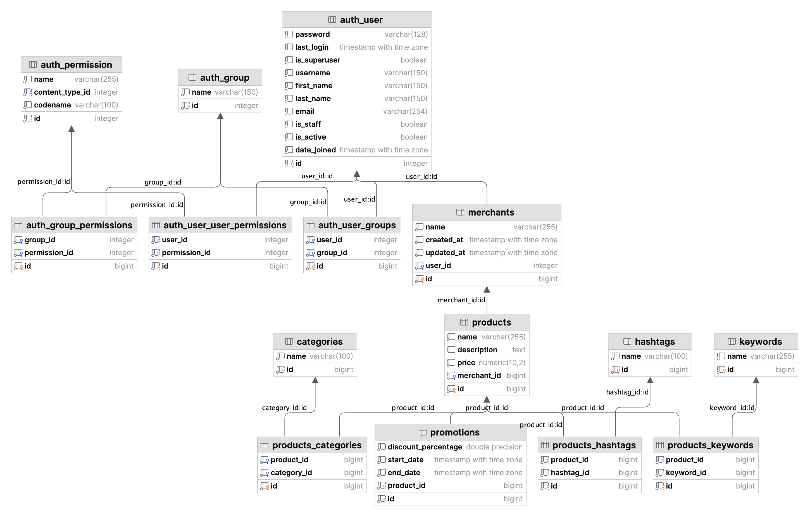

# Django REST API Framework Assignment

This is an assignment built with Django REST Framework.
This project was dockerized using docker compose.
It uses PostgreSQL as database.

## Purpose

This project was a task for a job interview.
The purpose of this project is to demonstrate my skills in designing, building, documenting and testing REST API.
I chose to use Django REST Framework from task's requirements. I selected PostgreSQL as the database because it is the most popular database for today's web applications.

## Requirements

Develop a Python program utilizing the Django Rest Framework, focusing on add/delete operations, and incorporating user sign-up/log-in functionalities.

Description

·       Ensure each user can create only one merchant.

·       Enable a merchant to create various products and services.

·       Allow each product and service to have multiple associated promotions.

·       Implement many-to-many relationships for categories, hashtags, and keywords with other tables.

·       Ensure the API includes pagination and JWT for user authentication.

·       While minor data adjustments are allowed, please maintain the overall integrity of the model structure.

Key Points

·       One user: One merchant.

·       One merchant: Multiple products/services.

·       One product/service: Multiple promotions.

·       Many-to-many relationships: Categories, hashtags, keywords with other tables.

·       Implement: API pagination and JWT authentication.

## Tech stack in this project
- Django REST framework
- drf-spectacula: API documentation with swagger
- djangorestframework-simplejwt: Used for JWT authentication
- loguru: Middleware write log to server in `/logs/api.log`

## Database Schema in this project



## Prepare for install

- You must install [Docker Compose](https://docs.docker.com/compose/install/) to run this project with docker
- Or you can host locally without docker (Not Recommended)

## Installation

You can either host the application with docker compose (recommended) or locally without docker.

### Clone the repository

``git clone https://github.com/airen95/dijango-rest-framework-assignment``

### Prepare environments

Copy file `env.example` to `.env` and fill information to your .env or keep it like `env.example`

### Host with docker

#### Build and run the containers

``docker compose up --build -d``

#### Run the migrations

``docker compose exec web python manage.py migrate``

#### Create a superuser - Optional

``docker compose exec web python manage.py createsuperuser``

#### API Documentation

The API documentation is available at [localhost:8000](http://localhost:8000/). It is generated using
[Swagger](https://swagger.io/). You need to start the server in order to see the documentation as it is being hosted
locally.

### Host locally without docker - Not Recommended

- If you want to host the application locally without docker, you will need to have Python 3.10+ installed.

- Make sure you already had `.env` file

- After than run the following commands:

````
cd .\app\
pip install -r requirements.txt
python manage.py migrate
python manage.py runserver
````

---
### Migration

If you make changes to the models, you will need to create migrations and run them to update the database.

``docker compose exec web python manage.py makemigrations``
``docker compose exec web python manage.py migrate``

### Application Folder Structure

````bash
.
└── root/
    ├── app/
    │   ├── config/
    │   │   ├── asgi.py
    │   │   ├── settings.py
    │   │   ├── wsgi.py
    │   │   └── urls.py
    │   ├── users/
    │   │   ├── migrations/
    │   │   │   └── 0001__initial.py #initial db
    │   │   ├── models.py
    │   │   ├── serializers.py
    │   │   ├── urls.py
    │   │   └── views.py
    │   ├── merchants
    │   ├── products
    │   ├── categories
    │   ├── hashtags
    │   ├── keywords
    │   ├── promotions
    │   ├── middlewares/
    │   │   └── logging_middleware.py
    │   ├── logs
    │   ├── Dockerfile
    │   ├── manage.py
    │   └── requirements.txt
    ├── docker-compose.yml
    ├── .env.example
    ├── run.sh
    └── README.md
````

### How to test API in Swagger

Step 1: You must register an user first in

````bash
POST: /users/register

{
  "username": "YOUR_USERNAME",
  "password": "YOUR_PASSWORD",
  "is_superuser": false (true if is_superuser)
}

````

Step 2: You login with above registered user

````bash
POST: /users/login

{
  "username": "YOUR_USERNAME",
  "password": "YOUR_PASSWORD"
}

````

You will receive JWT access token and refresh token in response

````bash
{
  "refresh": "YOUR_REFRESH_TOKEN",
  "access": "YOUR_ACCESS_TOKEN"
}

````

Step 3: In Swagger UI you click "Authorize" Button and copy the above access token then paste into jwtAuth Bearer Value Input. Then click Authorize. Now you can access protected APIs

`ACCESS_TOKEN_LIFETIME` will be 60 minutes. You can refresh token with:

````bash
POST: /users/token/refresh

{
  "refresh": "YOUR_REFRESH_TOKEN"
}

````

### Protected APIs in this project (need to have JWT access token with correct is_superuser or authenticated)

#### `[IsAuthenticated]` permission:

POST, PUT, PATCH, DELETE Hashtags

POST, PUT, PATCH, DELETE Keywords

POST, PUT, PATCH, DELETE Products

GET, POST, PUT, PATCH, DELETE Merchants

GET, POST, PUT, PATCH, DELETE Promotions


#### `[IsAdminUser]` permission:

POST, PUT, PATCH, DELETE Categories

The remain APIs will be `[AllowAny]`
